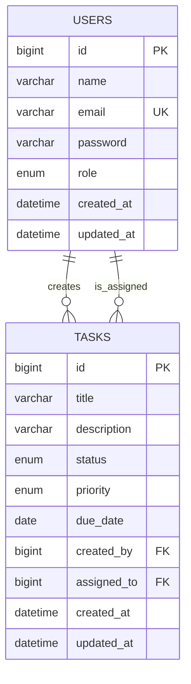

# TaskFlow database schema

```mermaid
erDiagram
    USERS ||--o{ TASKS : creates
    USERS ||--o{ TASKS : is_assigned
    USERS {
      bigint id PK
      varchar name
      varchar email UK
      varchar password
      enum role
      datetime created_at
      datetime updated_at
    }
    TASKS {
      bigint id PK
      varchar title
      varchar description
      enum status
      enum priority
      date due_date
      bigint created_by FK
      bigint assigned_to FK
      datetime created_at
      datetime updated_at
    }
```

`created_by` is required. `assigned_to` is nullable. User data is not duplicated in tasks; task responses map user information to DTOs.
